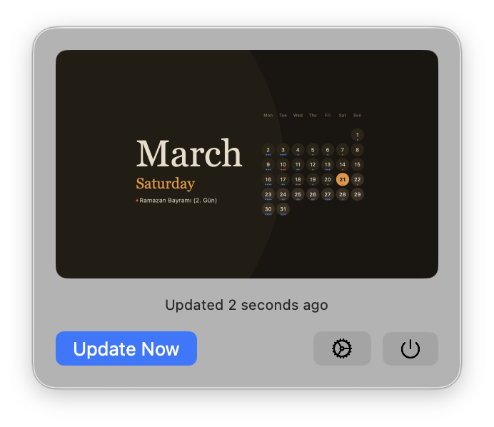
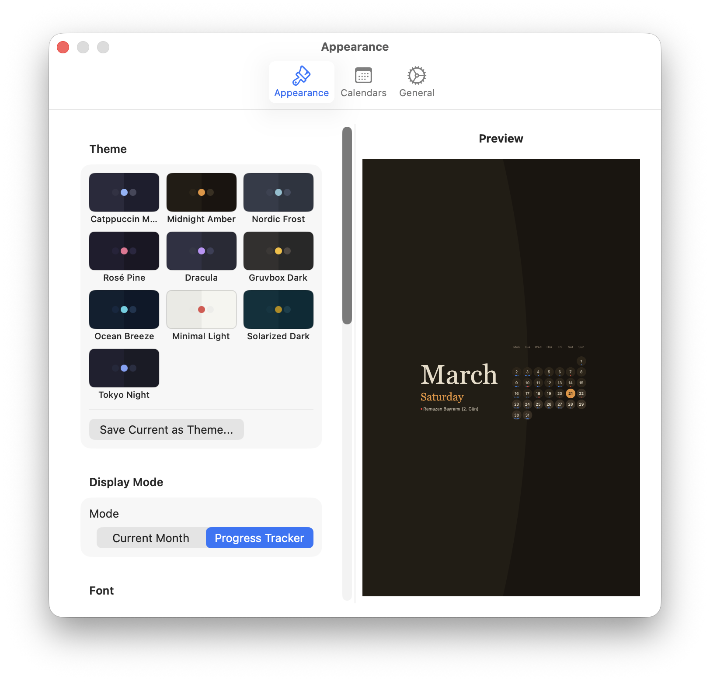
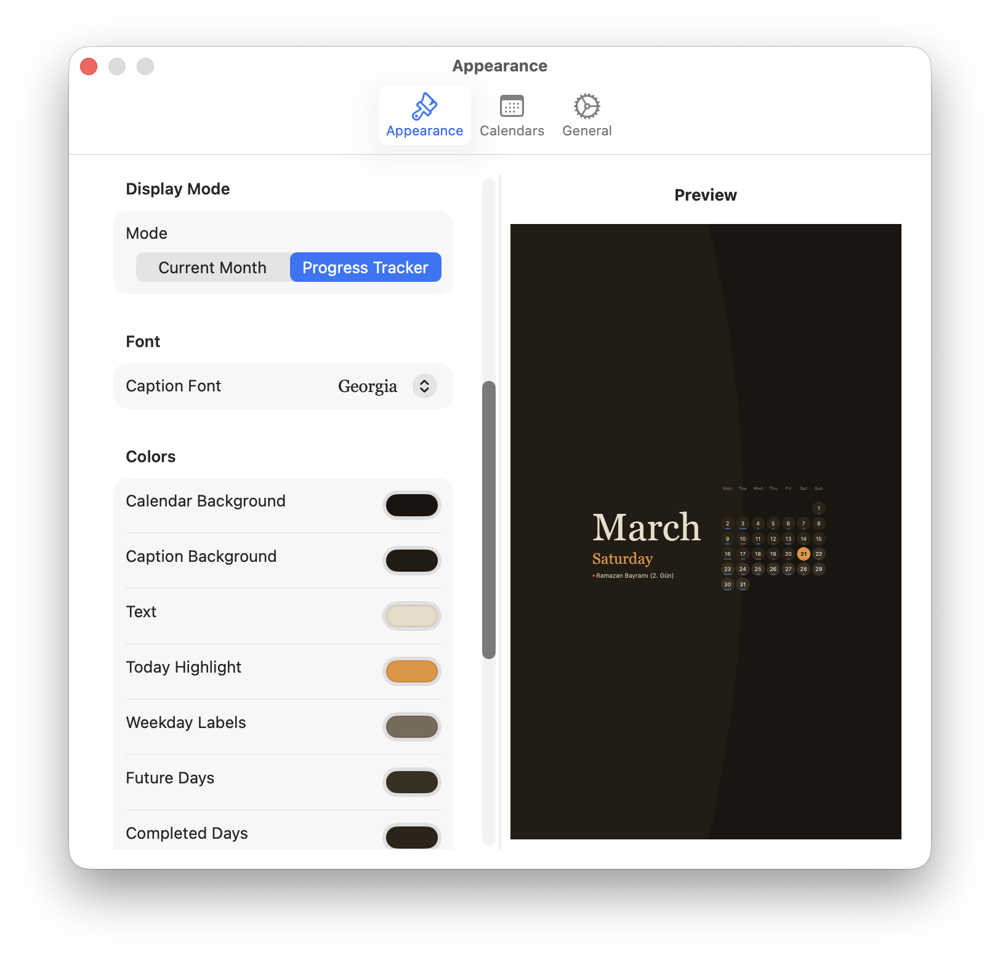
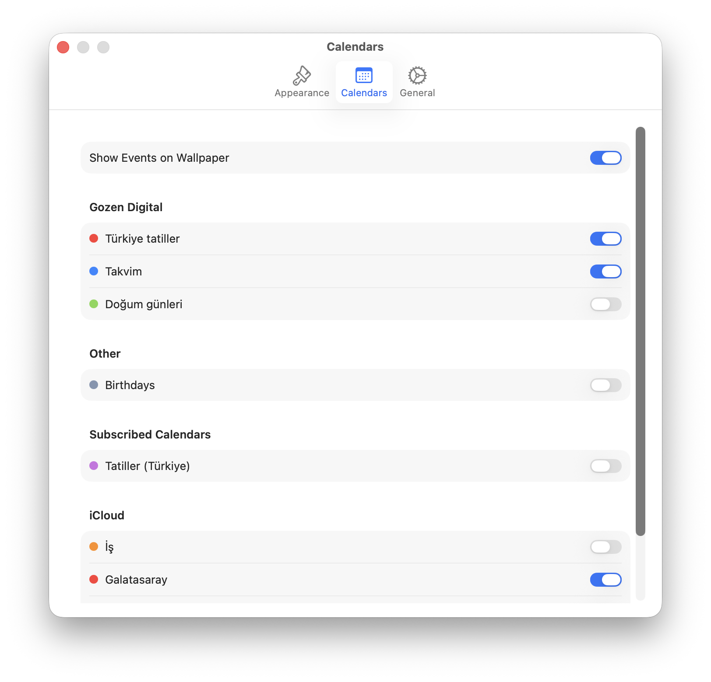

# Calpaper

A macOS menu bar app that turns your desktop into a beautiful calendar wallpaper.

  

## Features

- **Calendar Wallpaper** — Generates a wallpaper with the current month's calendar grid and a large stylized month name
- **Curved Split Design** — Left side shows month name and day with a smooth curved arc divider separating the calendar grid on the right
- **Progress Tracker Mode** — Past days are highlighted with a different color, making the calendar work like a visual progress bar for the month
- **10 Built-in Themes** — Catppuccin Mocha, Midnight Amber, Nordic Frost, Rosé Pine, Dracula, Gruvbox Dark, Ocean Breeze, Minimal Light, Solarized Dark, Tokyo Night
- **Custom Themes** — Save and load your own color schemes
- **Handwriting Fonts** — Choose from elegant fonts like Snell Roundhand, Zapfino, Bradley Hand, and more
- **EventKit Integration** — Shows today's calendar events below the day name on the wallpaper
- **Multi-Display** — Renders at native Retina resolution for each connected display
- **Auto-Update** — Wallpaper refreshes at midnight, on wake, and when displays change
- **Launch at Login** — Start automatically with your Mac
- **Auto-Updates** — Built-in Sparkle updater for seamless app updates

## Screenshots

<p align="center">
  
</p>
<p align="center"><em>Menu bar popover with wallpaper preview, update button, and quick actions</em></p>

<p align="center">
  
  <br>
  
</p>
<p align="center"><em>10 built-in themes, display modes, fully customizable colors and fonts with live preview</em></p>

<p align="center">
  
</p>
<p align="center"><em>Select which calendars to show — supports Apple, Google, Outlook, and any calendar synced to macOS</em></p>

## Installation

### Download
1. Download the latest `Calpaper-vX.X.dmg` from [Releases](https://github.com/berkaygure/calpaper/releases)
2. Open the DMG
3. Drag **Calpaper** to your Applications folder
4. Launch Calpaper — it appears as a calendar icon in the menu bar

### Build from Source
```bash
git clone https://github.com/berkaygure/calpaper.git
cd calpaper
open calpaper.xcodeproj
# Build and run with Xcode (⌘R)
```

## Usage

1. **Click the calendar icon** in the menu bar to see a preview
2. **"Set Wallpaper"** applies the wallpaper immediately
3. **Settings (gear icon)** opens the preferences window:
   - **Appearance** — Theme selection, colors, font, grid options, layout
   - **Calendars** — Toggle which calendars to show events from
   - **General** — Launch at login, check for updates

## Configuration

### Display Modes
| Mode | Description |
|------|-------------|
| Current Month | Standard calendar view |
| Progress Tracker | Past days highlighted, showing month progress |

### Grid Options
- **Show Only Current Month** — Hides leading/trailing days from adjacent months
- **Show Day Numbers** — Toggle between numbered cells and clean dots
- **Cell Shape** — Slider from square to fully round circles

### Layout
- **Calendar Size** — Scale the calendar grid
- **Position** — Place the calendar anywhere on screen with X/Y sliders

## Tech Stack

- **SwiftUI** — Menu bar app, settings UI
- **Core Graphics** — Wallpaper image rendering (NSImage, NSBezierPath)
- **EventKit** — Calendar and event access
- **Sparkle 2** — Auto-update framework
- **ServiceManagement** — Launch at login

## Creating a Release

```bash
# One-time: generate signing keys
./scripts/generate-keys.sh

# Build, sign, and package
./scripts/create-release.sh 1.1

# Publish
git add appcast.xml && git commit -m "release: v1.1"
git tag v1.1 && git push && git push --tags
gh release create v1.1 releases/Calpaper-v1.1.dmg --title "Calpaper v1.1"
```

## Requirements

- macOS 14.0 or later
- Calendar access (optional, for event display)

## License

MIT License — see [LICENSE](LICENSE) for details.
